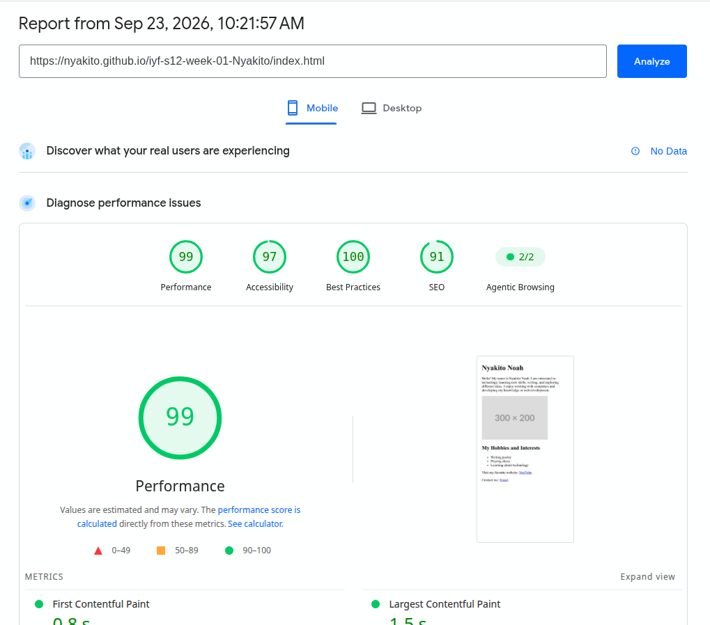

# Website Audit — `index.html`

## Issues I Found

### 1. Redirect links use have unclear naming

The page contains links that redirect users to other pages. The link text is intentionally descriptive so users can understand where each link will take them.

For example:

```html
<a href="www.youtube.com">youtube</a>
```

This is which I considered intentional naming is an issue. The link text clearly communicates its destination but doesn't instruct well

### 2. The page can make better use of semantic HTML

Some of the page structure can be improved by using semantic HTML elements such as:

* `<header>` for the introductory/header content
* `<nav>` for navigation links
* `<main>` for the primary page content
* `<section>` for related content
* `<footer>` for footer information

This makes the document structure clearer to browsers, developers, and assistive technologies.

### 3. The page uses a placeholder image

The page currently uses a placeholder image rather than a project-owned image.

but I have a images folder where I could could have a project image

### 4. The page structure can be improved

The content would be easier to understand and maintain if related content were grouped into appropriate semantic sections rather than relying primarily on generic containers or a flat document structure.

---

## How I Fixed Them

### 1. Changed the redirect link naming

A small change was required.

The link names were intentionally written to clearly describe their destination.

### 2. Added semantic HTML structure

The page was reorganized using semantic elements:

```html
<header>
    ...
</header>

<nav>
    ...
</nav>

<main>
    <section>
        ...
    </section>
</main>

<footer>
    ...
</footer>
```

This gives the page a clearer and more meaningful document structure.

### 3. Replaced the placeholder image

The external placeholder image was replaced with an image belonging to the project.

The image also retains descriptive `alt` text so that its purpose is available to users who cannot see the image.

### 4. Improved content grouping

Related content was grouped into appropriate semantic sections, making the HTML easier to read, maintain, and understand.

## 5. CHROME DEV AND WAVE WEB

The website, is highly rated as accesible




In both tools, the Websites accesibility Audit scored above 90%

---

## Summary

The main improvements to `index.html` focused on **semantic HTML, clearer document structure, accessibility, and meaningful project content**.
